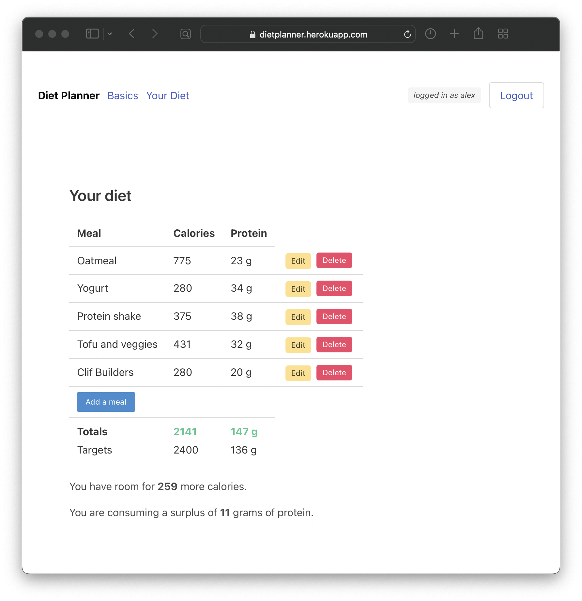

# Diet Planner

## Project description
Diet Planner is an app where bodybuilders can create a daily meal plan with the right amount of calories and protein depending on whether they want to gain muscle, lose fat, or maintain their current physique.

The app is built using React and Redux, and uses Bulma styling. The backend repo is [here](https://github.com/alexdietz1988/diet-planner-backend).

## User stories
1. I want to be able to sign up for an account or log in.
2. I want to be able to enter my current weight and my bodybuilding goal (bulk, cut, or maintain).
3. I want to be able to enter a list of the meals in my current diet, and the calories and protein content of each meal.
4. (Stretch) I also want to be able to enter the calorie and protein content of each ingredient, and have the calorie and protein content of the meal be calculated automatically.
5. I want to see how my calorie and protein diet compare with recommended targets for my bodybuilding goal.
6. I want to be able to update my diet by editing, removing, or adding meals or ingredients.

## Screenshot and ERD

## Development roadmap
- [x] User accounts
- [x] Users can enter weight, bodybuilding goal, and total daily energy expenditure
- [x] Users can add meals in their current diet, and the calorie and protein content of each meal
- [x] Users can edit and delete meals
- [x] Users can see how the calorie and protein content of their current diet compares with recommended targets
- [x] Bulma styling
- [x] Refactor using Redux
- [x] Deployment
- [ ] Refactor using redux-thunk
- [ ] Users can enter the calorie and protein content of specific ingredients in a meal, and have the calorie and protein content of the meal be calculated accordingly
- [ ] Users can change the order of their meals
- [ ] Signup/login with Google/Facebook/Apple
