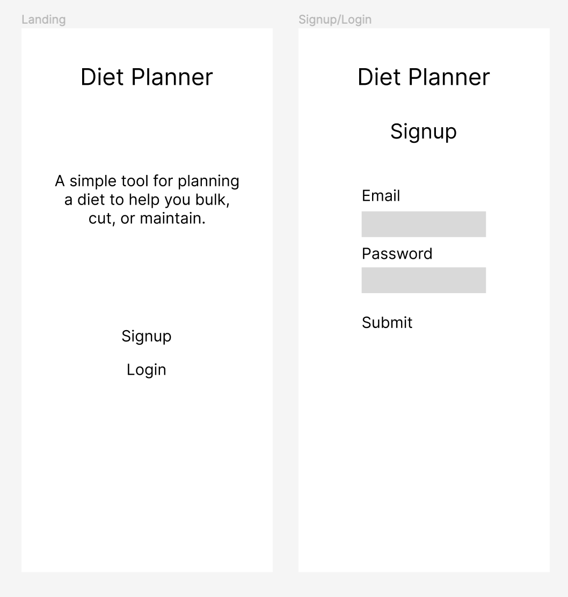
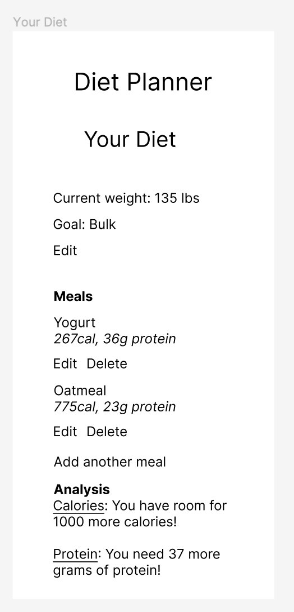
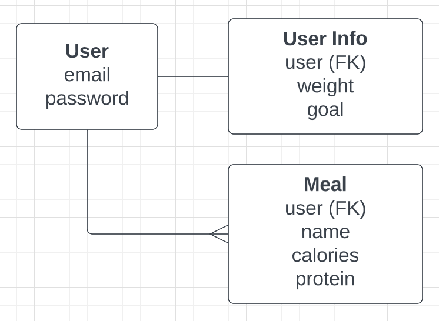

# Diet Planner

## Project description
Diet Planner is an app where bodybuilders can create a daily meal plan with the right amount of calories and protein depending on whether they want to gain muscle, lose fat, or maintain their current physique.

## User stories
1. I want to be able to sign up for an account or log in.
2. I want to be able to enter my current weight and my bodybuilding goal (bulk, cut, or maintain).
3. I want to be able to enter a list of the meals in my current diet, and the calories and protein content of each meal.
4. (Stretch) I also want to be able to enter the calorie and protein content of each ingredient, and have the calorie and protein content of the meal be calculated automatically.
5. I want to see how my calorie and protein diet compare with recommended targets for my bodybuilding goal.
6. I want to be able to update my diet by editing, removing, or adding meals or ingredients.

## Wireframes

## ERD
